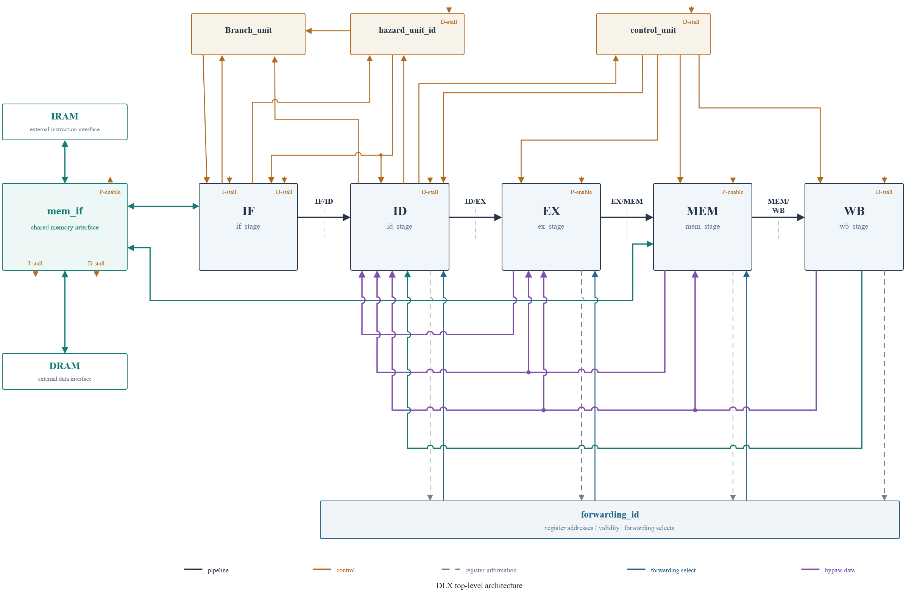
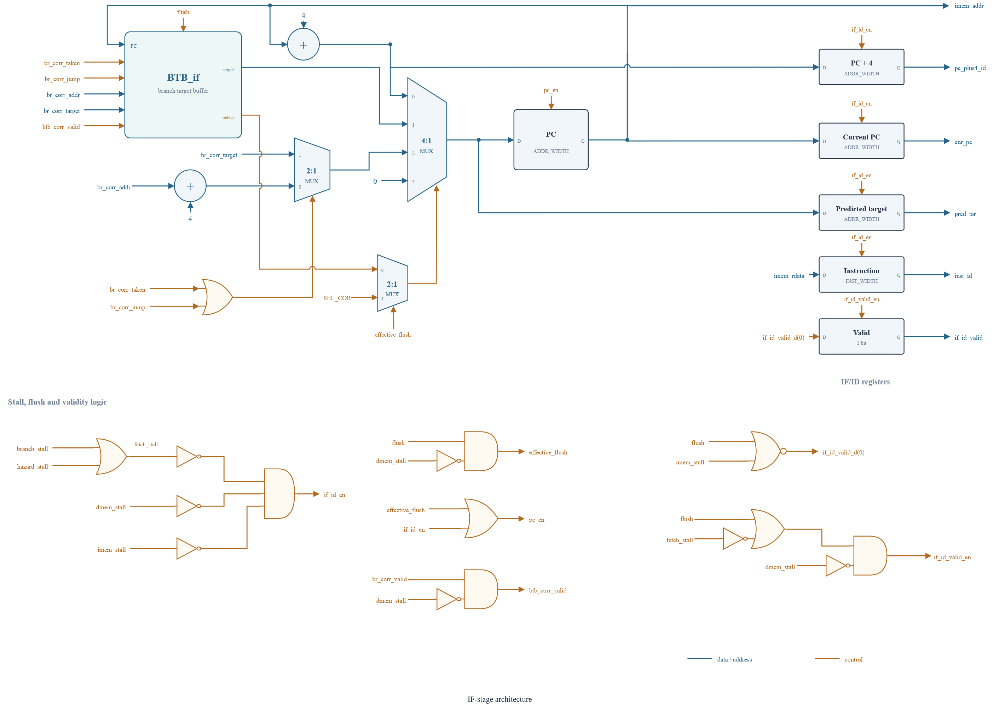
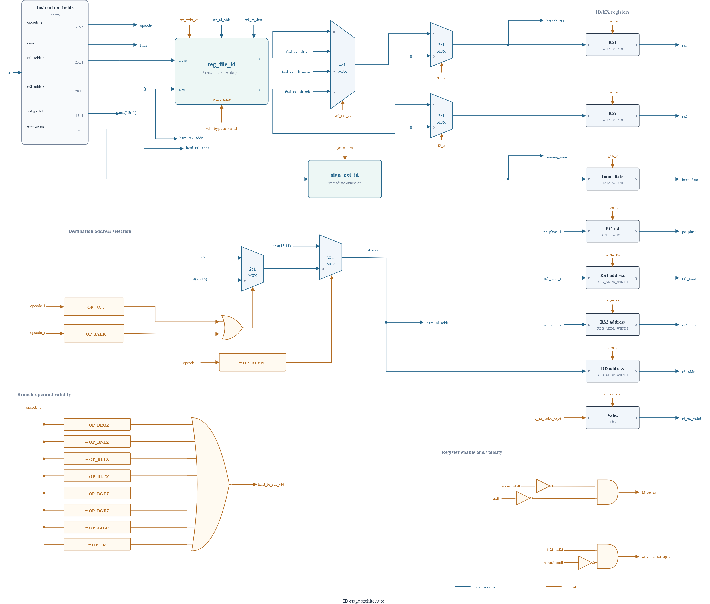
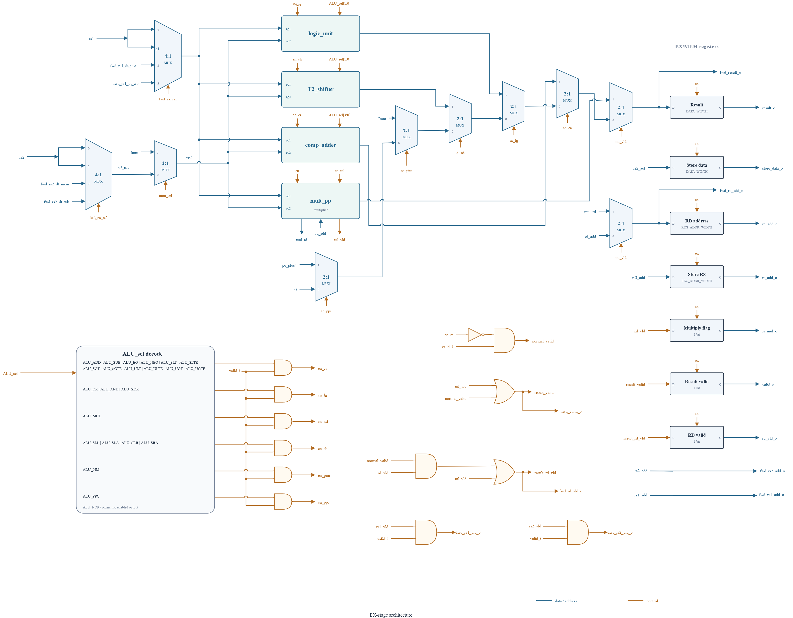
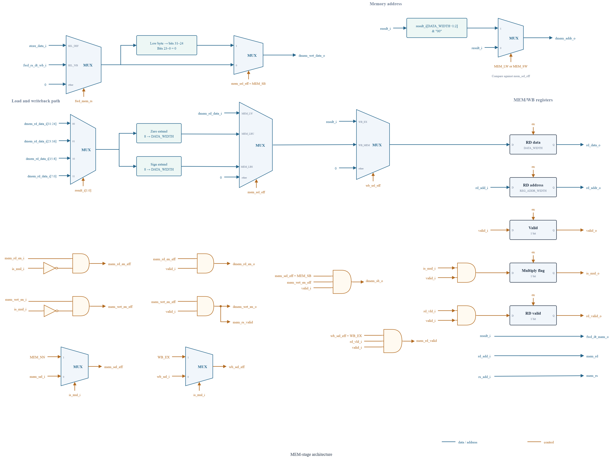
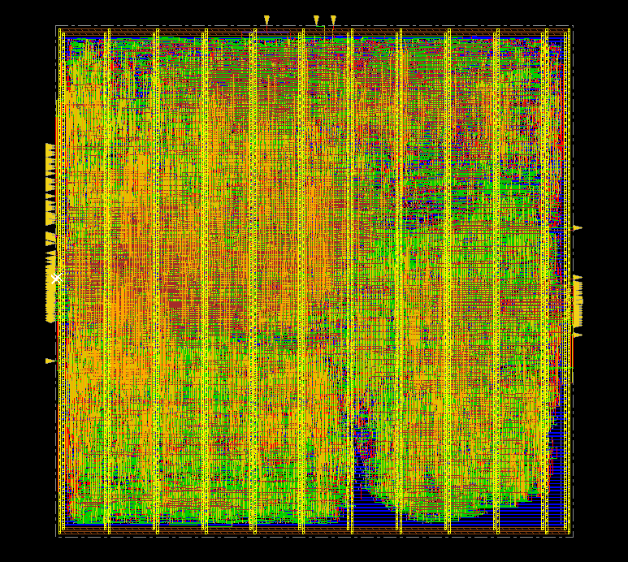

# DLX Processor

This repository collects the architecture notes, verification results, synthesis exploration, and physical-design results of my DLX processor implementation.

The complete RTL is not published here because of university obligations. The public repository is therefore focused on the design decisions, diagrams, implementation flow, and results. The RTL can be shared privately where permitted.

The final physical implementation runs at **556.8 MHz** with a **36,647.884 µm² standard-cell area** and **23.107 mW** total power at the typical corner (1.1 V).
## Architecture

The processor is a 32 bit, five stage in-order pipeline:

**IF → ID → EX → MEM → WB**

The implementation follows the usual DLX pipeline structure, but most of the work involved coordinating the stages: forwarding, hazard handling, branch correction, memory stalls, and the multi-cycle multiplier.



### Instruction Fetch

The IF stage maintains the program counter and interfaces with instruction memory. A 16-entry direct-mapped BTB is used for branch prediction. Control-flow corrections coming from Decode can replace the predicted path and redirect the PC.



### Instruction Decode

Decode is the most control heavy stage of the processor. It handles instruction decoding, register file access, immediate generation, hazard checking, forwarding for Decode, and branch/jump resolution.

Branches are resolved in ID rather than EX. This keeps the branch correction penalty short, but it also makes Decode part of an important timing path back toward IF.

The forwarding and hazard logic handles dependencies from instructions still in EX, MEM, and WB. A scoreboard-style mechanism is used to determine when an operand is not yet available and the pipeline must stall. Stalling holds the earlier pipeline state while a bubble is inserted into the following stage.



### Execute

The EX stage contains the arithmetic, logic, shift, comparison, and multiplication datapaths. Operands can be forwarded from later pipeline stages when the required value has not yet reached the register file.



The main execution units were implemented explicitly in RTL rather than relying only on generic arithmetic operators:

- **P4 adder:** a 32 bit fast adder based on sparse carry generation and 4 bit carry select blocks. It is reused in the arithmetic datapath, branch target calculation, and the final addition stage of the multiplier.

- **Comparator/adder:** combines addition, subtraction, and comparison in the same datapath. Comparisons are obtained from the subtraction operation, so a separate comparator is not needed.

- **T2 shifter:** a structural 32 bit shifter supporting logical and arithmetic shifts. The shift amount is split into coarse and fine selections, with mask generation and final selection stages.

- **Multiplier:** a two stage pipelined \(32\times32\) multiplier using radix-4 Booth encoding and a Dadda tree for partial product reduction. The final two rows are combined using the P4 adder, and the lower 32 bits of the product are returned.

Multiplication is a multi cycle operation. Its property supported by the hazard unit, both for result issue and for handling data dependencies.

### Memory and Writeback

The MEM stage handles loads and stores and connects the internal pipeline to the external data memory interface. The design supports word and byte accesses.

The external memory interface also converts the pipeline requests into the instruction and data memory request and propagates memory stalls back into the pipeline.



WB selects the value returned to the register file from the available result sources.

## Verification

Functional verification was based mainly on directed assembly programs.

The assembler/compiler used to generate the memory images was provided by the university and was modified to match the implemented ISA. Each test program has an expected final data-memory image.

The flow is:

```text
assembly program
      ↓
assembler
      ↓
instruction/data memory images
      ↓
RTL simulation
      ↓
final data-memory dump
      ↓
comparison with expected memory image
```

The tests cover arithmetic and logic operations, shifts, comparisons, branches and jumps, byte/word memory accesses, multiplication, pipeline dependencies, forwarding, stalls, and small integrated workloads.

The RTL passed the complete regression: the produced memory dumps matched the corresponding expected memory images.

## Synthesis Flow

Synthesis was performed with Synopsys Design Compiler. Rather than choosing one clock constraint, the design was synthesized across a clock sweep, mainly from **0.7 ns to 1.8 ns**.

The requested synthesis period was treated as an optimization constraint, not automatically as the final operating period. For every generated mapping, the actual critical path was measured and the same mapped design was then reanalyzed at:

```text
analysis period = critical-path delay + 5%
```

The mapping was reloaded for this step rather than synthesized again, so timing, area, and power still referred to the same implementation.

The sweep also showed that tighter constraints did not monotonically produce faster mappings. The most aggressive synthesis points could generate worse mappings, and the 0.7 ns and 0.8 ns mappings were excluded because they did not pass the required mapped-netlist functional regression.

Clock-gated variants were explored with different minimum register widths. After functional filtering and comparison of timing, area, and activity-aware power, the selected mapping was:

```text
clock_gated_w32_sweep_1.2ns
```

The **1.2 ns** value is the synthesis target, not the final operating period. The selected mapping was analyzed at approximately **1.796 ns**, corresponding to about **556.8 MHz** with the chosen 5% margin.

For this mapping, synthesis reported approximately:

| Metric | Result |
|---|---:|
| Analysis period | 1.796 ns |
| Frequency | 556.8 MHz |
| Dynamic power | 7.87 mW |
| Total power | 8.357 mW |
| Area | 24352.6 |

Switching activity for power analysis came from simulation using an average workload intended to give a representative activity mix.

## Physical Design

The selected netlist was taken through a physical design flow using **Cadence Innovus** with **Nangate45/FreePDK45** technology. The implementation used the **1.796 ns** operating period selected after synthesis, corresponding to approximately **556.8 MHz**.

The flow was:

```text
Synthesized netlist
        ↓
Floorplan
        ↓
Power planning
        ↓
Placement
        ↓
Clock-tree synthesis
        ↓
Routing
        ↓
Post-route setup/hold optimization
        ↓
Timing, power and DRC checks
```


A square floorplan was used with **60% initial utilization**. Power distribution used VDD/GND rings and stripes. Signal routing used **metal1–metal6**.

Placement, Clock tree synthesis was then performed with targets of **50 ps transition** and **20 ps skew**, followed by routing and post-route setup/hold optimization.

Post-route timing was analyzed at typical, slow, and fast corners. For the scope of the project, timing closure was accepted at the **typical corner**, where the design achieved **+103 ps setup slack** and **+18 ps hold slack**, with no setup or hold violations at **556.8 MHz** under the applied constraints. External interface timing was not fully specified.

Full closure is not claimed. The slow corner had a setup WNS of **−300 ps**, while the fast corner had a hold WNS of **−33 ps**.



The post-route implementation contained **22,343 instances**. The main physical metrics were:

| Metric | Result |
|---|---:|
| Standard-cell area | 36,647.884 µm² |
| Core area | 40,624.584 µm² |
| Die area | 44,827.490 µm² |
| Final utilization | 90.211% |

Typical-corner post-route power at **1.1 V** was evaluated using the updated activity assumptions:

| Power component | Result |
|---|---:|
| Internal | 11.636 mW |
| Switching | 10.546 mW |
| Leakage | 0.925 mW |
| **Total** | **23.107 mW** |

Compared with the earlier **30.712 mW** vectorless estimate, the updated total is approximately **24.8% lower**. This difference reflects the change in activity assumptions.

Connectivity verification reported no problems, and no electrical design rule violations were reported. **Four physical DRC violations remained, including one metal short**.